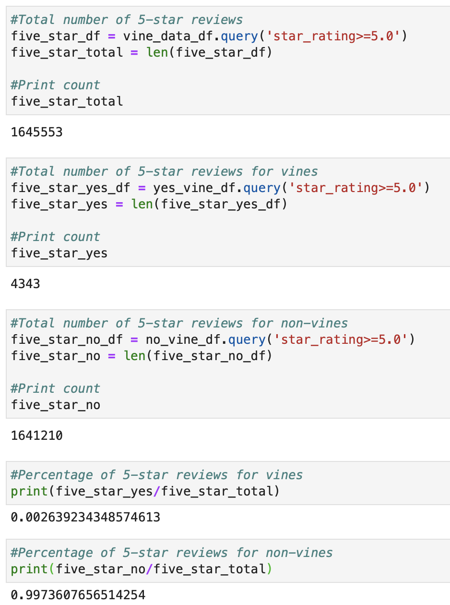

# Overview
Amazon sponsors a program called the Amazon Vine Program. In this program, organizations such as SellBy pay a nominal fee to provide products to members who, in exchange, post ratings and reviews of the products. We have selected the pet product category to analyze reviews written by vine- and non-vine members and determine if there is any positivity bias among vine-member reviews.

We first performed ETL on the product reviews utilizing Google CoLabs, Amazon Web Services, and PostgeSQL. Then, using Pandas, we were able to further manipulate our exported data to dig into any potential positivity bias driven by this program.

# Results:
- Our dataset contained a total of 2,643,619 reviews. 
- 10,215 of these reviews were part of the Vine program.
- 2,633,399 were not part of the Vine program.
- A total of 1,645,553 reviews earned 5-star reviews.
- 4343 of these 5-star reviews were part of the Vine program.
- The remaining 1,641,210 5-star reviews were not part of the Vine program.
- 0.2% of the 5-star reviews were part of the Vine program while 99.7% were not part of the program

# Summary: 
Based upon our analysis, there does not appear to be any inherent positivity bias among Vine program reviews, specifically in the pet product category.

Only about 10,000 of the 2.6 million collected reviews on pet products were part of the Vine program. 1.6 million reviews earned 5 stars, and only 4,343 of those reviews were still part f the vine program. 

Based on our results below, 0.26% of the total 5-star ratings were Vine program reviews while 99% were not part of the program. If we take a look at the larger dataset, about .3% (10215/2643619) of the total reviews were part of the vine program, thus we would expect roughly .3% of the 5-star ratings to also be part of the program. Extremely close!

In order to determine if this bias truly exists or does not exist, we recommend reviewing a variety of datasets, as there may be more likelihood for other products to generate positivity bias among paid reviews.

